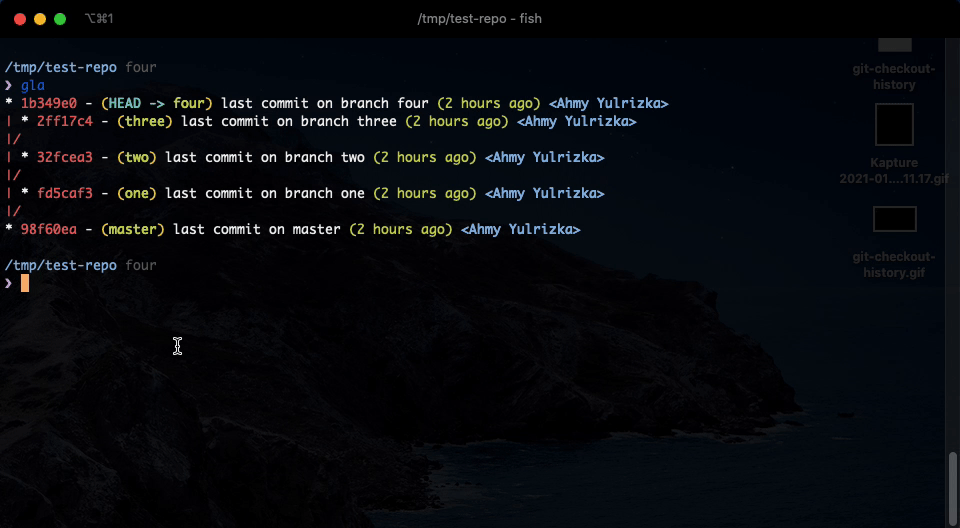

# git-checkout-history

The script will make it easy to switch to branch that was checked-out previously




## Requirements
1. [fzf](https://github.com/junegunn/fzf) - command line fuzzy finder


## Installation

Download the script to an executable directory (eg: /usr/local/bin)

```shell
$ wget -P /usr/local/bin https://raw.githubusercontent.com/yulrizka/git-checkout-history/master/git-checkout-history
$ chmod +x /usr/local/bin/git-checkout-history
```

## Note

Without Fzf installed, it will just print the history to std out.


[License](LICENSE)
------------------
MIT License

Copyright (c) 2021 Ahmy Yulrizka
